# Lettria Perseus — Ontology Editor Manual

A guide to the visual ontology editor in Lettria Perseus.

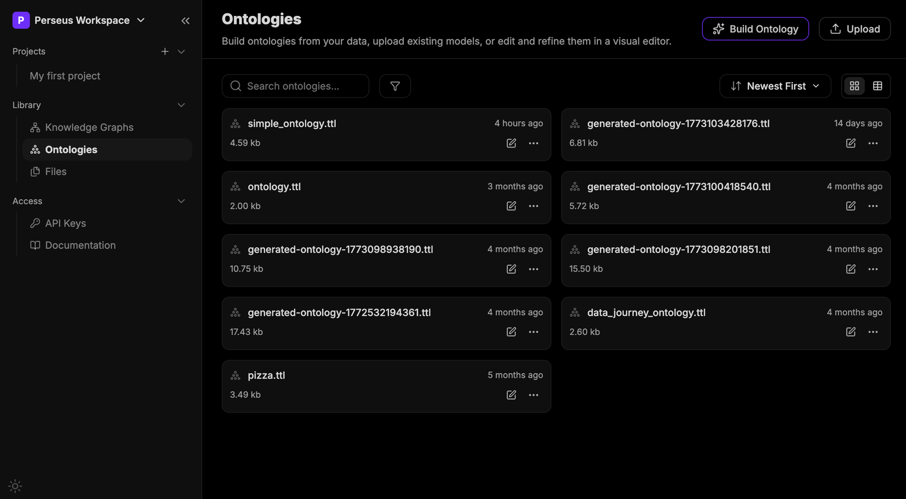

---

## Table of Contents

1. [What this tool is for](#1-what-this-tool-is-for)
2. [Concepts and Vocabulary](#2-concepts-and-vocabulary)
    - [Graph](#graph)
    - [Ontology](#ontology)
    - [Class](#class)
    - [Individual](#individual)
    - [Property](#property)
    - [Domain and Range](#domain-and-range)
    - [Annotation](#annotation)
    - [URI / IRI](#uri--iri)
    - [Prefixes you will see in the dropdowns](#prefixes-you-will-see-in-the-dropdowns)
    - [Turtle (.ttl)](#turtle-ttl)
    - [Where WebProtégé fits in](#where-webprotégé-fits-in)
3. [Getting to the editor](#3-getting-to-the-editor)
    - [The Ontologies library](#the-ontologies-library)
    - [The card menu: simple and advanced](#the-card-menu-simple-and-advanced)
    - [Evaluation](#evaluation)
    - [Details](#details)
    - [Three ways to get an ontology](#three-ways-to-get-an-ontology)
    - [Building an ontology from your files](#building-an-ontology-from-your-files)
4. [The editor layout](#4-the-editor-layout)
5. [Working with Classes](#5-working-with-classes)
    - [Adding a class](#adding-a-class)
    - [The class detail panel](#the-class-detail-panel)
    - [Annotations](#annotations)
    - [Relationships](#relationships)
    - [Parents and Children](#parents-and-children)
6. [Working with Properties](#6-working-with-properties)
    - [The three property tabs](#the-three-property-tabs)
    - [The property detail panel](#the-property-detail-panel)
    - [Adding a property](#adding-a-property)
7. [Working with Individuals](#7-working-with-individuals)
    - [Adding an individual](#adding-an-individual)
    - [Types](#types)
    - [Relationships between individuals](#relationships-between-individuals)
    - [Identity: Same as / Different from](#identity-same-as--different-from)
8. [Saving and version history](#8-saving-and-version-history)
    - [Save with a commit message](#save-with-a-commit-message)
    - [Browsing previous versions](#browsing-previous-versions)
    - [Discard](#discard)
9. [Keyboard shortcuts](#9-keyboard-shortcuts)
10. [A complete worked example](#10-a-complete-worked-example)

---

## 1. What this tool is for

Perseus extracts structured data out of unstructured documents. Left alone, it will
extract whatever it finds. An **ontology** is how you tell it what it is *allowed* to
find: which kinds of things exist in your domain, what attributes they have, and how
they can be connected to one another.

The ontology editor is where you inspect and hand-tune that schema. Use it to:

- Review an ontology that Perseus generated from your documents, and fix what it got wrong.
- Add a class or a relationship the generator missed.
- Rename things so the extracted graph uses your team's vocabulary.
- Seed a few known entities (individuals) so extraction has anchors to attach to.

An ontology editor is a schema editor. It is closer in spirit to editing a database schema
than to editing data — except the "schema" here is itself expressed as a graph.

---

## 2. Concepts and Vocabulary

### Graph

A **graph** is nodes connected by edges. In a knowledge graph the nodes are *things*
(San Francisco, Jane Doe, the USA) and the edges are *labelled relationships* between
them (`Jane Doe —LOCATED_IN→ San Francisco`).

The unit of information is a **triple**: subject, predicate, object.

```
Jane Doe    LOCATED_IN    San Francisco
  ↑             ↑              ↑
subject     predicate       object
```

Everything in the editor — every class, every property, every annotation — compiles down
to a pile of triples. The UI is a friendlier face over that.

### Ontology

An **ontology** is the schema of the graph: the vocabulary and the rules. It declares
that `Person` and `City` are kinds of things, that `LOCATED_IN` is a legal edge, and
that it may run from a `Person` to a `City` (but not, say, from a `Year` to a `Year`).

In relational terms, an ontology is roughly your `CREATE TABLE` statements plus your
foreign key constraints, except it is more expressive and it is stored as data rather
than as DDL.

An ontology is *not* your data. It describes the shape of your data.

### Class

A **class** is a type — a category of thing. `Person`, `City`, `Country`, `Year`.
Class names are conventionally singular and PascalCase.

Classes form a hierarchy. `City` can be a child of `Place`, which can be a child of
`Thing`. A child class is a **subclass**: every `City` is automatically also a `Place`.
This is the "is-a" relationship from OO inheritance, and as in some OO languages, a class
can have more than one parent.

Perseus displays this hierarchy in the left panel of the **Classes** tab, with an
expand chevron on any class that has children.

### Individual

An **individual** is one specific, named instance of a class. `San Francisco` is an
individual of class `City`. `Jane Doe` is an individual of class `Person`.

Class is to individual as `class Person` is to `new Person("Jane")` — the type versus
one concrete thing of that type.

You do not have to declare every individual in your ontology; extraction will discover
most of them from your documents. You declare the ones you want to guarantee exist, or
the ones you want to attach known facts to.

### Property

A **property** is a named edge — the predicate in a triple. Perseus splits them into
three kinds, the same split OWL uses, and they behave differently:

| Kind | Points from | Points to | Example |
| --- | --- | --- | --- |
| **Object property** | an individual | another individual | `LOCATED_IN`, `employs`, `manages` |
| **Datatype property** | an individual | a literal value (string, number, date) | `name`, `description`, `url` |
| **Annotation property** | any resource | metadata about the model itself | `rdfs:label`, `rdfs:comment` |

Which kind you want is decided by the right-hand side. If the thing on the right is
something you would want to describe further — it has its own attributes, its own
relationships — it is an **object property**. If it is just a value, a string or a number,
it is a **datatype property**.

`Jane Doe LOCATED_IN San Francisco` is an object property: San Francisco is a real
entity with its own facts. `Jane Doe name "Jane Doe"` is a datatype property: the string
is just a string. `employer` pointing at a `Company` is an object property; `employerName`
holding a string is a datatype property. The first is usually what you want in a knowledge
graph — the links are the point of the graph.

Annotation properties are the odd one out: they carry documentation, not domain facts.
They are for humans and tools, and reasoners ignore them.

### Domain and Range

Every object and datatype property has a **domain** and a **range**.

- **Domain** = the class(es) the *subject* is allowed to be. The left side of the arrow.
- **Range** = the class(es) the *object* is allowed to be. The right side of the arrow.

In the sample ontology, `LOCATED_IN` has domain `{City, Country}` and range
`{City, Person, Country}`. Read that as: *"the thing doing the locating can be a City or a
Country; the thing it is located in can be a City, a Person, or a Country."*

Listing multiple classes in a domain or range means *any of them* is acceptable — it is
a union, not an intersection.

Domain and range are how you constrain extraction. A property with a narrow domain and
range is a strong signal to the extractor; a property with neither will match almost
anything. Start narrow, look at the extracted graph, and widen only where you see real
misses.

### Annotation

An **annotation** is human-readable metadata attached to a class, property, or
individual. It has no effect on the logic of the graph; it exists so that you, your
teammates, and the extraction model can tell what a thing means.

The most common ones:

- `rdfs:label` — the display name. Perseus sets this for you when you name a resource.
- `rdfs:comment` / `dcterms:description` / `skos:definition` — a prose description.
- `rdfs:seeAlso`, `rdfs:isDefinedBy` — pointers to related or defining resources.

Annotations are **language-tagged**. Each annotation row has a language selector on the
right (`en (English)`, or the generic `lang` if unset). This is how one ontology serves
a multilingual pipeline: the same class can carry an English label and a French label.

Descriptions are load-bearing. Perseus's extraction is LLM-driven, and a class's
annotations are part of what the model reads when deciding whether a span of text is an
instance of that class. An `rdfs:comment` on `Person` saying *"an individual human named in
the source text, not a fictional or hypothetical person"* changes what comes back. Leaving
it blank leaves the model guessing.

### URI / IRI

Every resource in an ontology has a globally unique identifier, written as a URL, shown in
grey at the top-right of every detail panel:

```
http://www.w3.org/2002/07/owl#Country
http://example.org/ontology#employs
```

It is an *identifier*, not an address — nothing is fetched from it. It exists so that
two ontologies from two different teams can be merged without `Person` colliding with
`Person`.

The part after the `#` is the local name, which Perseus derives from the name you type. A
freshly created, still-unnamed resource gets a placeholder URI with a timestamp in it
(`owl#timestamp-1783753869409`); once you type a real name, the URI settles to
`owl#Country`. That is expected. Just don't save a resource while it is still called
*Untitled*.

### Prefixes you will see in the dropdowns

The `rdfs:` / `owl:` / `dcterms:` prefixes in the annotation dropdown are shorthand for
long URIs. Knowing what family a term comes from helps you pick the right one:

| Prefix | Stands for | Use it for |
| --- | --- | --- |
| `rdf:` | RDF core | the raw triple model; `rdf:type` |
| `rdfs:` | RDF Schema | `rdfs:label`, `rdfs:comment`, subclass/subproperty |
| `owl:` | Web Ontology Language | classes, properties, `sameAs`, `differentFrom` |
| `skos:` | Simple Knowledge Organization System | `skos:definition`, thesaurus-style vocabularies |
| `dc:` / `dcterms:` | Dublin Core | `title`, `description`, generic document metadata |

When several of them offer near-identical terms (`rdfs:comment` vs `dcterms:description`
vs `skos:definition`), pick one and be consistent across the ontology. Consistency
matters more than which one you picked.

### Turtle (.ttl)

Ontologies in Perseus are stored as **Turtle** files — a plain-text serialisation of
RDF triples, hence the `.ttl` extension on every ontology in the library. It is readable:

```turtle
:San_Francisco  rdf:type      :City .
:San_Francisco  rdfs:label    "San Francisco"@en .
:San_Francisco  :LOCATED_IN   :USA .
```

You never have to write Turtle to use the editor. But everything you do in the UI is
building these lines, and if you export an ontology this is what you get.

Turtle is also your tiebreaker. If you cannot tell whether a field did what you meant —
whether that Relationship row landed as a schema constraint or as an actual fact — save,
then open **View TTL** from the ontology card's `...` menu and read the source.

### Where WebProtégé fits in

Perseus's editor is modelled on **WebProtégé**, the browser version of Protégé, the
open-source ontology editor from Stanford. The mental model transfers directly: the same
Classes / Properties / Individuals split, the same domain/range semantics, the same
annotation-based documentation, the same commit-with-a-message revision history.

Perseus is a deliberately smaller surface. It drops WebProtégé's heavier OWL machinery
(complex class expressions, restrictions, reasoner integration, discussion threads) in
favour of the subset that drives Perseus extraction.

---

## 3. Getting to the editor

### The Ontologies library

In the left sidebar of the Perseus workspace, under **Library**, click **Ontologies**.
(The sibling entries are **Knowledge Graphs** — the extracted output — and **Files** —
the source documents.)

The Ontologies page lists every ontology in the workspace as a card showing its filename,
size, and last-modified time. You get a search box, a filter, a **Newest First** sort,
and a grid/table view toggle.

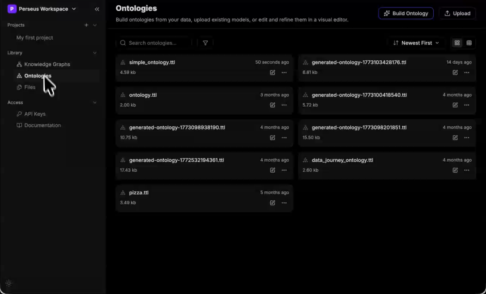

Each card has a **pencil icon** (open in the editor) and a **`...` menu**.

### The card menu: simple and advanced

The `...` menu comes in two forms. Which one you get depends on the ontology.

The **simple menu** has five actions, and every ontology has these:

| Action | What it does |
| --- | --- |
| **Edit** | Opens the ontology in the visual editor. Same as the pencil icon. |
| **View TTL** | Shows the raw Turtle source — the ground truth for what the editor has built. See [Turtle (.ttl)](#turtle-ttl). |
| **Download** | Exports the `.ttl` file. Use this to commit an ontology to your own repo, diff two versions outside Perseus, or hand it to another tool. |
| **Rename** | Renames the file. Note this renames the *file*, not the resources inside it. |
| **Delete** | Deletes the ontology from the workspace. |

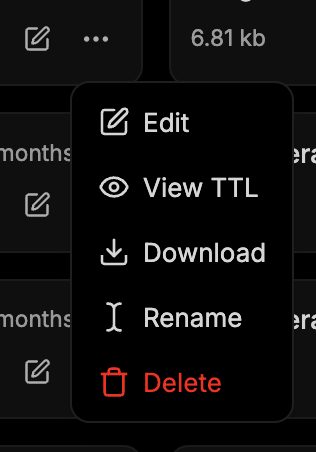

The **advanced menu** adds two entries at the top — **Evaluation** and **Details**:

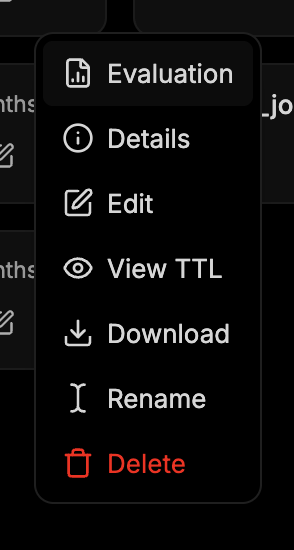

Both extras are reports about *how the ontology was produced*, not about its current
contents. They appear on ontologies that Perseus generated with **Build Ontology**, because
that build runs as a job and the job is what produces them: the timeline, the use case you
typed, and the quality analysis. An ontology that arrived any other way — uploaded, or
converted from another schema — has no such job behind it, so it gets the simple menu.

Two consequences worth knowing:

- Editing and saving an ontology does **not** refresh its Evaluation. The report describes
  the ontology as the build produced it, so it goes stale the moment you start editing.
- If you download a generated ontology and upload it again, the copy shows the simple menu
  even though the file is byte-for-byte identical. The reports belong to the build job, not
  to the file.

### Evaluation

A quality analysis of the generated ontology, scored out of 5 across four criteria —
**Structural quality**, **Semantic quality**, **Documentation quality**, and **Best
practices** — shown as a radar chart with a prose overall assessment beneath it.

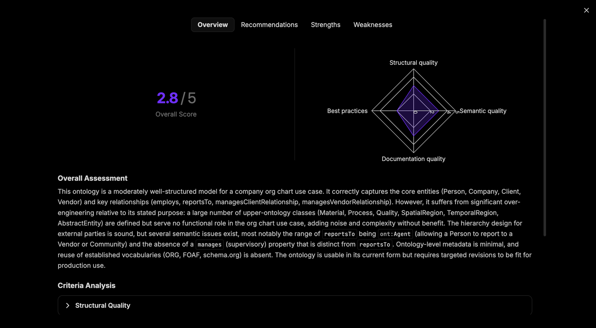

Four sub-tabs:

- **Overview** — the overall score, the radar chart, the written assessment, and a
  **Criteria Analysis** section you can expand per criterion.
- **Recommendations** — concrete, actionable changes, each with a justification. These are
  specific: *"Restrict the range of `ont:reportsTo` from `ont:Agent` to `ont:Person`"*,
  *"Remove the classes `ont:Material`, `ont:Process`… along with their disjointness axioms."*
  This tab is the most directly useful one — it is a work list you can take straight into
  the editor.
- **Strengths** — what the generator got right, and why it is right.
- **Weaknesses** — where the model is wrong or over-built, with the reasoning.

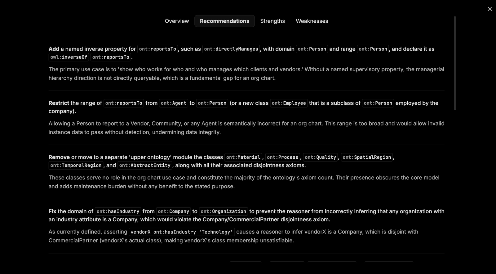

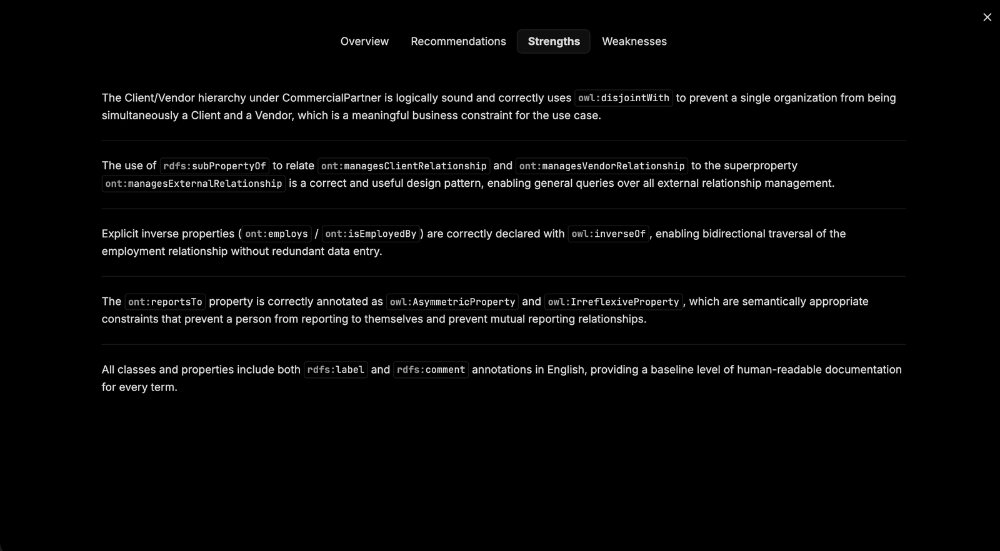

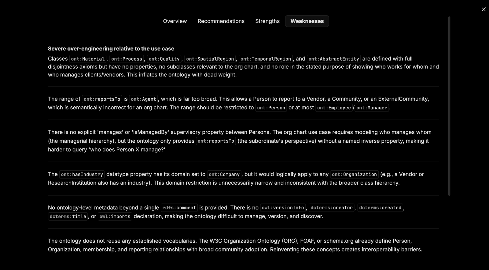

The evaluation judges the ontology *against the use case you described*, which is why the
use case is worth writing carefully — it is the yardstick. A common finding is
over-engineering: the generator emits upper-ontology classes (`Material`, `Process`,
`Quality`, `SpatialRegion`, `TemporalRegion`, `AbstractEntity`) that play no part in your
actual use case and only add noise.

### Details

The execution record of the generation job: a timeline of **Submitted → Started → Running →
Succeeded** with timestamps and duration, the job ID, the **Files** it was built from, the
**Languages** selected, and the **Usecase** text you typed in the wizard.

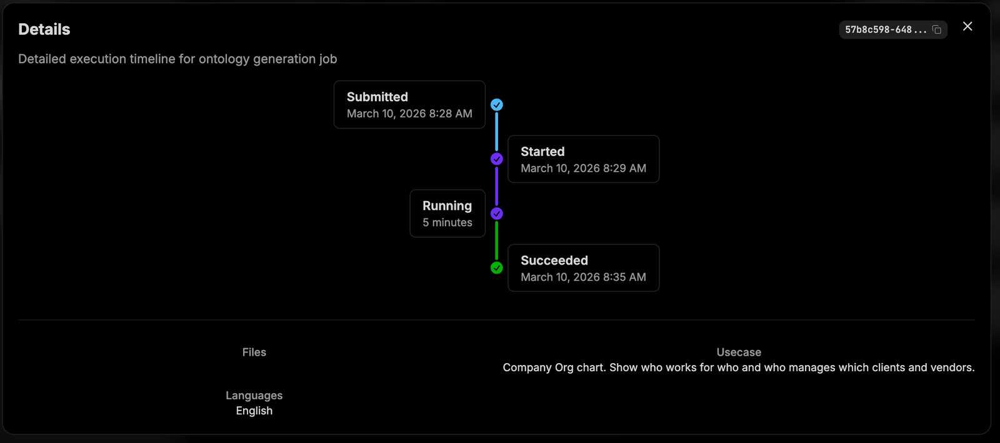

This is where to look when you have forgotten what a generated ontology was *for* — the use
case is recorded here verbatim, and nowhere in the editor.

### Three ways to get an ontology

1. **Build Ontology** — let Perseus generate one from documents you have already uploaded.
   Start here. Generating from a handful of representative documents gets you most of the
   way, and what remains is much easier to see with something concrete in front of you than
   from a blank ontology.
2. **Upload** — bring an existing `.ttl` file. Useful if you already maintain an ontology
   elsewhere, or you are importing a standard vocabulary.
3. **Open an existing one** and edit it. Perseus-generated ontologies are named
   `generated-ontology-<timestamp>.ttl` until you rename them.

### Building an ontology from your files

**Build Ontology** opens a three-step wizard:

**1. Select files** — tick the workspace files to derive the ontology from. Perseus reads
them to work out what classes and relationships your domain contains, so pick files that
are representative rather than exhaustive.

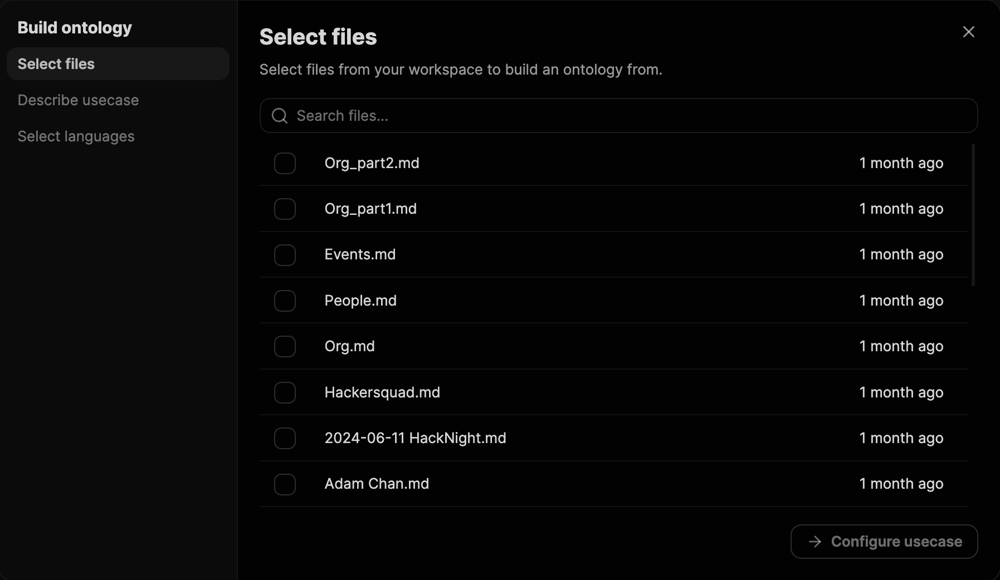

**2. Describe usecase** — a free-text box describing what you are modelling and what you
will use the graph for. This steers what the generator considers important enough to become
a class, so be specific about the questions you want the finished graph to answer.

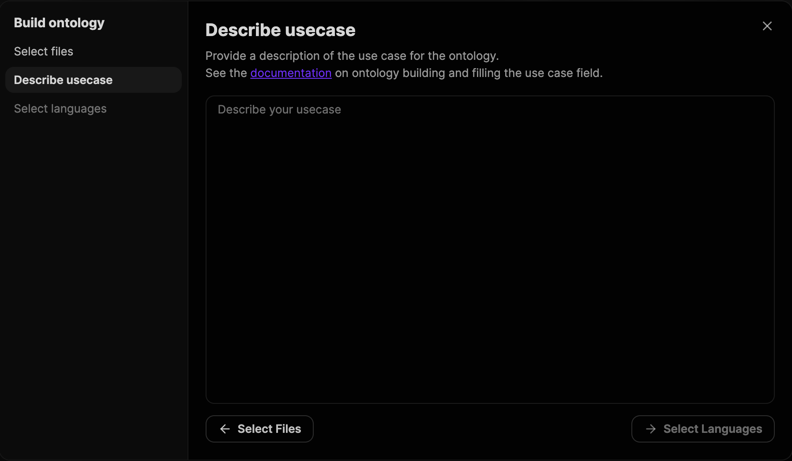

**3. Select languages** — tick the languages the ontology should carry labels in (Arabic,
Chinese, English, French, German, Italian, Spanish). This drives the language tags on the
generated annotations.

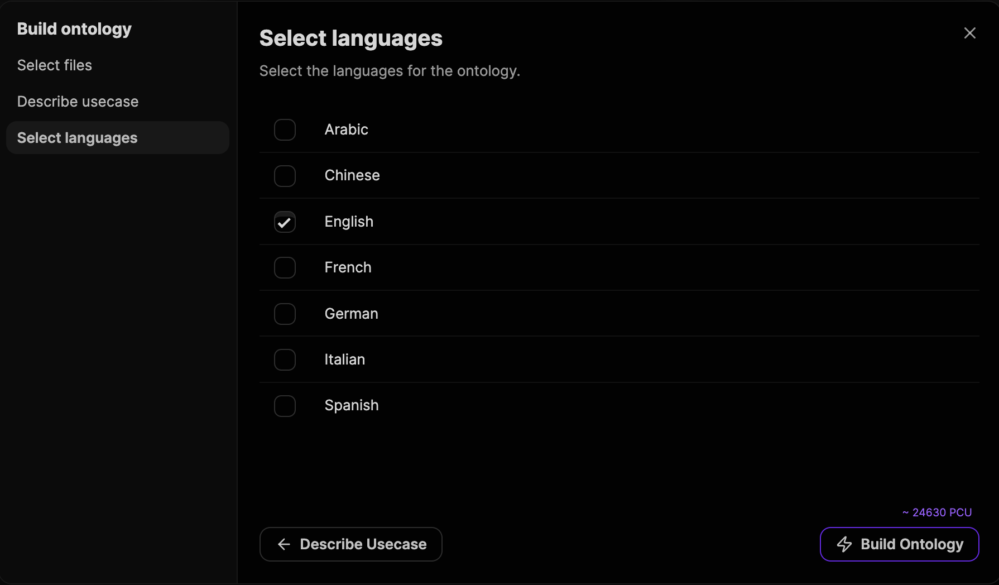

The final screen shows an estimated cost in **PCU** (Perseus Compute Units) before you
commit. Click **Build Ontology** to run it. When it finishes, the new ontology appears in
the library.

Expect to edit. A generated ontology is a strong first draft, not a finished artifact.
Before you open the editor, open the card's `...` menu → **Evaluation** →
**Recommendations**: the build has already reviewed its own output and told you what to fix.
Working that list is the fastest way to a usable ontology.

---

## 4. The editor layout

Open an ontology and you get a full-screen editor.


The header, left to right:

| Element | What it does |
| --- | --- |
| **←** | Back to the Ontologies library. |
| **Filename** | The name of the ontology you have open. |
| **Classes / Properties / Individuals** | The three tabs. Each is a different view of the same ontology. |
| **⌨ icon** | Opens the keyboard shortcuts modal. |
| **↶ / ↷** | Undo / redo. |
| **Version chip** | The current commit hash (e.g. `cd494f51312665`) with a **Latest** badge. Click the chevron for the version history dropdown. |
| **Discard** | Throw away all unsaved changes. |
| **Save** | Commit your changes with a message. |

Below the header, every tab uses the same two-panel shape:

- **Left panel** — a searchable, filterable list of resources of that kind, plus an
  **Add** button at the top.
- **Right panel** — the detail form for whatever you selected. Empty until you select
  something ("No class selected — Select a class in the left panel to inspect it").

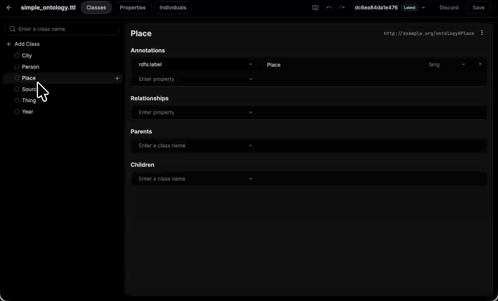

Every detail panel shows the resource's **name as an editable heading**, its **URI** in
grey at the top-right, and a **`⋮` menu** next to the URI.


That menu holds one action — **Delete Class** (or Delete Property / Delete Individual,
depending on the tab). It is the only way to remove a resource other than the `⌘⇧⌫`
shortcut.

Deleting is not a soft operation: if other resources referenced the deleted one — a class
used as a property's domain, an individual on the far side of a relationship — those
references go with it. Deletion only lands when you **Save**, so `⌘Z` will walk it back and
**Discard** will undo it wholesale.

Changes are held in memory as you work. Nothing is persisted until you **Save**.

---

## 5. Working with Classes

The **Classes** tab is where you define the types of thing in your domain.

### Adding a class

Two ways:

- **`+ Add Class`** at the top of the left panel — creates a new top-level class.
- Hover any existing class and click the **`+`** that appears on its right — creates a
  new class *as a child of that one*. This is the fast way to build a hierarchy.

Either way you get a class named **Untitled**, selected, with a placeholder timestamp
URI. Type over the heading in the right panel to name it. Perseus writes the name into
`rdfs:label` and rewrites the URI to match.

> Naming convention: singular, PascalCase — `Country`, not `countries`.

### The class detail panel

Selecting a class shows four sections.


### Annotations

Free-form documentation. Each row is: **property** + **value** + **language tag**.

Click the **Enter property** dropdown to pick the annotation type. The list runs
`rdfs:label`, `rdfs:comment`, `skos:prefLabel`, `skos:altLabel`, `skos:definition`,
`dcterms:title`, `dcterms:description`, `dc:title`, `dc:description`, `rdfs:seeAlso`,
and `rdfs:isDefinedBy`. Type the value on the right, set the language on the far right,
and add another row as needed. The `×` removes a row.

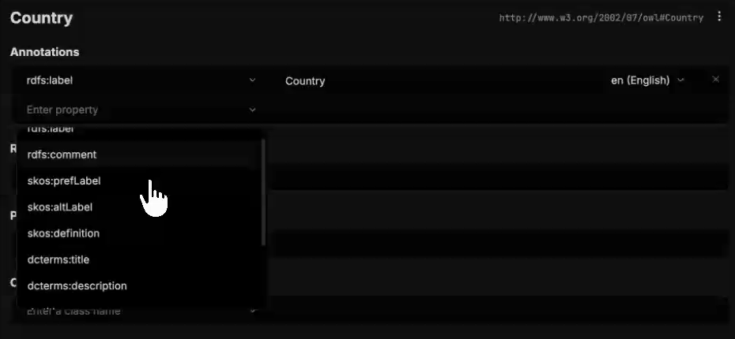

A newly-named class arrives with `rdfs:label` already filled in. Add a description too — it
is part of the prompt the extractor reads, so it directly affects extraction quality. See
[Annotation](#annotation).

`skos:prefLabel` and `skos:altLabel` are worth knowing: the first is the preferred display
name, the second holds synonyms. Putting known aliases on a class (`Firm`, `Corporation`
as altLabels of `Company`) gives the extractor more surface to match against.

### Relationships

The relationships that can *start* at this class. Each row is **two dropdowns**: the
**property**, and then the **class on the other end of it**.

The property dropdown lists every object property defined in the ontology
(`ASSOCIATED_WITH`, `description`, `LOCATED_IN`, `MENTION`, `name`, `url` in the sample
ontology).

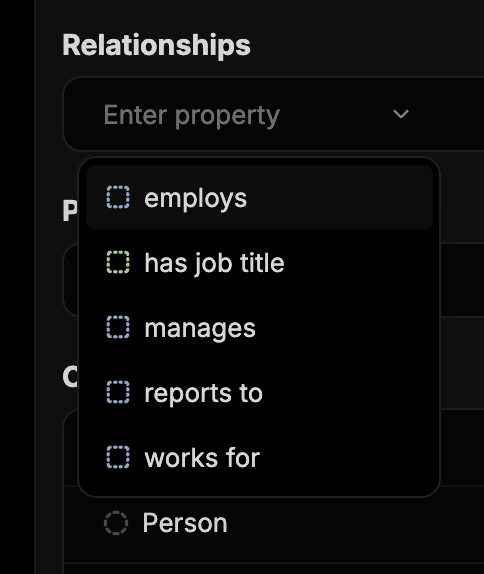

Once a property is chosen, the second dropdown — **Enter a class name** — offers every
class in the ontology. That is the class on the far side of the relationship.


Read a completed row as a sentence. `ManagingGeneralAgent` + `has delegated authority
from` + `InsuranceCarrier` says *"a managing general agent may have delegated authority
from an insurance carrier."*

This is the same fact as the property's **domain** and **range**, entered from the other
side: the class you are looking at goes into the property's domain, and the class you pick
on the right goes into its range. You can work from either end — the Relationships box on
the class is the convenient side when you are thinking class-first, the Domain and Range
boxes on the property are the convenient side when you are thinking edge-first. See
[The property detail panel](#the-property-detail-panel).

> The Properties tab is the ground truth. If you are ever unsure what a Relationships row
> actually asserted, open the property there and read its Domain and Range.

### Parents and Children

The subclass hierarchy.

- **Parents** — the classes this one is a subclass of. Type or pick a class name. A class
  may have several parents.
- **Children** — the classes that are subclasses of this one.

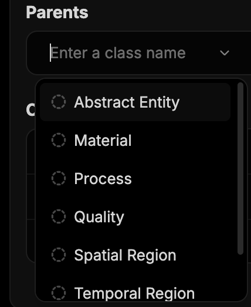

The two are views of the same fact. Setting `City`'s parent to `Place` is identical to
adding `City` to `Place`'s children; the other panel updates accordingly. Use whichever
direction you are thinking in.

Parent/child means strict is-a, not "related to": everything true of the parent is true of
the children. If you would not say "every X is a Y", do not make X a child of Y — model it
as an object property between them instead. Treating is-a as a general-purpose "related to"
is the most common modelling error.

---

## 6. Working with Properties

The **Properties** tab is where you define the edges.

### The three property tabs

Three filter chips at the top of the left panel — **Object**, **Datatype**, **Annotation**
— switch which kind of property you are looking at. The Add button relabels itself to
match (`+ Add Object Property`, `+ Add Datatype Property`, …).

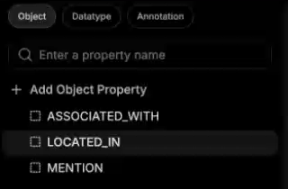

Object = entity-to-entity, datatype = entity-to-literal, annotation = documentation. See
[Property](#property) for choosing between them.

### The property detail panel

Select a property and you get:

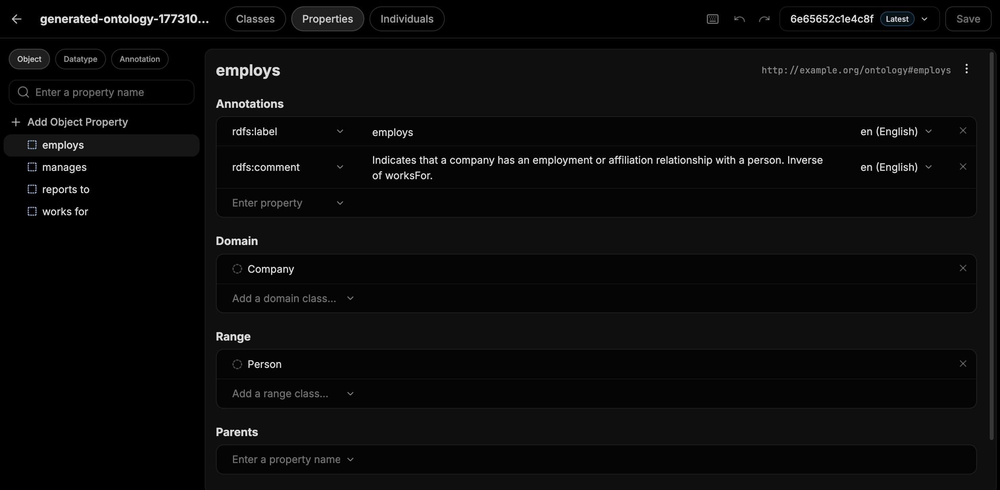

- **Annotations** — same widget as on classes. `rdfs:label` plus, ideally, an
  `rdfs:comment` explaining exactly when this relationship applies. In the sample data,
  `employs` carries the comment *"Indicates that a company has an employment or affiliation
  relationship with a person. Inverse of worksFor."* — that is the standard to aim for.
- **Domain** — the classes allowed on the *left* of this relationship. Add with
  **Add a domain class…**, remove with the `×`.
- **Range** — the classes allowed on the *right*. Add with **Add a range class…**.
- **Parents / Children** — the sub-property hierarchy. Rarely needed, but it lets you say
  e.g. that `manages` is a specialisation of `works with`; every `manages` triple then also
  counts as a `works with` triple.

Domain and range are the fields that do the real work — getting them right is most of what
makes extraction precise. See [Domain and Range](#domain-and-range).


### Adding a property

Click **`+ Add Object Property`** (or the datatype/annotation equivalent), name it in the
heading, then set its domain and range. A property with an empty domain and range is legal
but unconstrained, and will match far more loosely than you want. Start narrow and widen
later.

> Naming convention: the generated ontologies use two styles — `SCREAMING_SNAKE_CASE` for
> object properties (`LOCATED_IN`, `ASSOCIATED_WITH`) and lowerCamelCase or plain words for
> datatype properties (`name`, `url`, `has job title`). Neither is required. Pick one
> convention per ontology and hold to it.

---

## 7. Working with Individuals

The **Individuals** tab holds concrete, named entities. The left panel lists each
individual with its class in grey on the right (`San Francisco — City`).

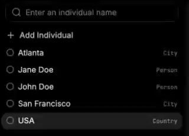

### Adding an individual

Click **`+ Add Individual`**, then type its name over the heading. As with classes, it
starts as an unnamed resource with a timestamp URI which settles once you name it.

An individual with no type is not useful, so the next step is always Types.

### Types

The **Types** section is where you declare which class(es) this individual is an instance
of. Pick from the class dropdown. Once set, the class appears next to the individual's
name in the left panel.

This is the `rdf:type` triple — `:San_Francisco rdf:type :City`. An individual can have
more than one type.

### Relationships between individuals

The **Relationships** section is where you assert actual facts. Note how it differs from
the identically-named section on a *class*:

- On a **class**, Relationships declares what is *possible* (schema).
- On an **individual**, Relationships states what is *true* (data).

Each row is two dropdowns: pick the **property** on the left, then **Pick an individual…**
on the right.


`Jane Doe` + `LOCATED_IN` + `San Francisco` creates exactly one triple:

```turtle
:Jane_Doe :LOCATED_IN :San_Francisco .
```

The right-hand dropdown only lists individuals that already exist, so create the target
individual before the relationship that points at it.

### Identity: Same as / Different from

Two fields at the bottom:

- **Same as** (`owl:sameAs`) — asserts that this individual and another are *the same
  real-world thing under two names*. `:NYC owl:sameAs :New_York_City`. Anything true of
  one is now true of the other. This is the mechanism for reconciling duplicates that
  extraction produced from different documents.
- **Different from** (`owl:differentFrom`) — asserts they are definitively *not* the same
  thing, even though they look similar. Useful for pinning apart two people with the same
  name, and for preventing a downstream deduplication step from merging them.

Left unset, neither is assumed. Two individuals with different URIs are not automatically
considered distinct — this is the *open-world assumption* that RDF inherits, and it is why
`differentFrom` needs to exist at all.

---

## 8. Saving and version history

Perseus versions ontologies like a git repository. Every save is a commit with a hash and
a message, and you can browse back through them.

### Save with a commit message

Click **Save** (or `⌘S`). A **Save ontology** dialog appears with a **Commit message**
field. Type a short description of what changed — *"Added Country"*, *"People-[LOCATED_IN]→City"* —
and click **Save**.

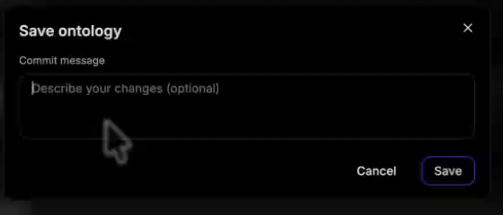

The version chip in the header updates to the new hash and keeps the **Latest** badge.

Save is a commit, not an autosave. Nothing persists until you click it, and navigating away
or hitting **Discard** loses everything since the last one. Save early and often — the
version history is cheap, and it is the only path back.

The message field is technically **optional**, and Perseus will commit without one. Fill it
in anyway. These messages *are* the version history dropdown, and a list of unlabelled
hashes is not a history you can navigate.

### Browsing previous versions

Click the chevron next to the version chip. You get the full commit list, newest first —
each entry showing its hash and its commit message, with **Latest** marked and a check
against the version you are currently viewing. Select any entry to load that version of the
ontology.

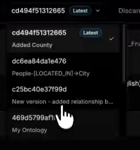

### Discard

**Discard** throws away every unsaved change and returns you to the last saved version. It
does not delete anything that has been committed. There is no undo for Discard — but there
is `⌘Z` for individual mistakes, which is usually what you actually want.

---

## 9. Keyboard shortcuts

Open the shortcuts modal with the **⌨ icon** in the header, or `⌘⇧?`.

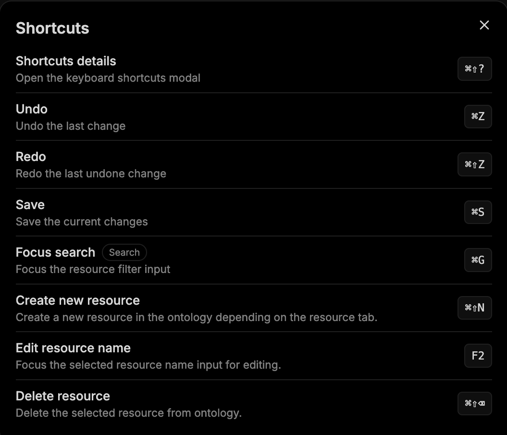

| Action | Shortcut | Notes |
| --- | --- | --- |
| Shortcuts details | `⌘⇧?` | Opens this modal. |
| Undo | `⌘Z` | Undo the last change. |
| Redo | `⌘⇧Z` | Redo the last undone change. |
| Save | `⌘S` | Opens the commit-message dialog. |
| Focus search | `⌘G` | Jumps to the left-panel filter input. |
| Create new resource | `⌘⇧N` | Creates a class, property, or individual — whichever tab you are on. |
| Edit resource name | `F2` | Focuses the selected resource's name for renaming. |
| Delete resource | `⌘⇧⌫` | Deletes the selected resource from the ontology. |

On Windows and Linux, substitute `Ctrl` for `⌘`.

`⌘G` → type → `⌘⇧N` → type name → `F2` is the fast loop for building out a hierarchy
without touching the mouse.

---

## 10. A complete worked example

This exercise walks the whole editor — a class, a property, individuals, facts, a commit —
in six steps. Open any ontology you have; a generated one from **Build Ontology** works
well, since it already has classes and properties to build on.

The walkthrough below uses a small ontology whose classes include `City` and `Person` and
whose object properties include `LOCATED_IN`. Substitute your own names as you go: the
shape of each step is the same whatever your domain is. The goal is to add a class that is
missing, wire it into an existing relationship, and then state two facts using it.

**1. Add the missing class.** Classes tab → **`+ Add Class`** → the new *Untitled* class
appears. Type a name over the heading — here, `Country`. Perseus fills in
`rdfs:label = "Country"` with language `en (English)` and settles the URI to `owl#Country`.

**2. Document it.** In **Annotations**, add a second row: `dcterms:description`, with a
sentence explaining what counts as a Country in this domain.

**3. Let the new class participate in a relationship.** Properties tab → **Object** →
select an existing property, here `LOCATED_IN`. Under **Range**, click
**Add a range class…** and add `Country`. Its range becomes `{City, Person, Country}` and
its domain is `{City, Country}` — so a City may now be `LOCATED_IN` a Country.


**4. Create two individuals.** Individuals tab → **`+ Add Individual`** → name it
`Jane Doe` → under **Types**, pick `Person`. Repeat: **`+ Add Individual`** → `USA` → under
**Types**, pick `Country`. The left panel now shows each individual with its class beside it.

**5. Assert the facts.** Assuming an individual `San Francisco` of class `City` already
exists:

- Select `Jane Doe` → **Relationships** → property `LOCATED_IN`, individual `San Francisco`.
- Select `San Francisco` → **Relationships** → property `LOCATED_IN`, individual `USA`.

**6. Commit.** **Save** → commit message *"Added Country"* → **Save**. The version chip
changes to a fresh hash carrying the **Latest** badge, and the new commit is at the top of
the version dropdown.

In Turtle, what you just built is:

```turtle
:Country       rdf:type       owl:Class ;
               rdfs:label     "Country"@en .

:LOCATED_IN    rdfs:range     :City, :Person, :Country .

:Jane_Doe      rdf:type       :Person ;
               :LOCATED_IN    :San_Francisco .

:San_Francisco rdf:type       :City ;
               :LOCATED_IN    :USA .

:USA           rdf:type       :Country .
```
